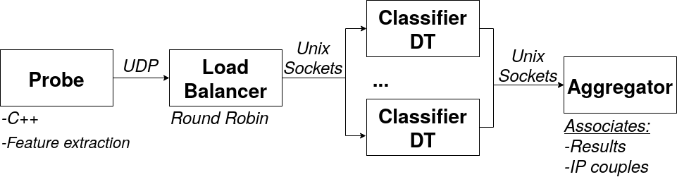

# Map Reduce

----

## Objective
- CG classifier :fire:
- Tells if a IP pair is CG or not
- *Production Launch*

----

## How it works
- In the folder, just execute `main.py`.
- You can select (_line 4_) the total number of classification nodes `NB_NODS` (*1 to M*)
- It launches:
  - The *Load Balancer*
  - The *DT classifiers* (`NB_NODS`)
  - The *Aggregator*
- Once the program is executed, you wil be prompted:
  - The **IP couples** considered by the program
  - The total number of **CG reports** for each couple (~1 per conversation each 33ms)
  - The total number of **NCG reports** for each couple (~1 per conversation each 33ms)

----

## The Overall Architecture

----

## The 'Probe'
- Developped by Xavier MARCHAL, in C++.
- Sends UDP reports:
  - One UDP packet per report
  - One report per conversation, each 33ms
- See: :point_right: https://github.com/Nayald/probe-CG-detection

----

## The 'UDP SRV'
- A UDP server, listens to the reports sent by the **Probe**
- Extracts the features and the IP address couple
- There is a *Round Robin* to share the load accross **Nodes**
- Communication through `pipes` (*multiprocessing.Pipe*)
- **Data sent**:

| IP1   | IP2 |
|-      |-    |

| Mean Size | Std Size  | Mean IAT | Std IAT | Sum Sizes | # Paks  |
|-          | -         | -        |    -     | -         |     -   |

} (IP1 :arrow_right: IP2) & (IP2 :arrow_right: IP1) : 14 fields

----

## The 'Node'
- Responsible of the classification
- Each nodes starts by loading the ML model (*joblib - scikit-learn DT*)
- Reads in its pipe the IP couple and its features sent by **UDP SRV**
- Does the classification and sends the result to the **Aggregator**
- **Data sent**:

| IP1   | IP2 |
|-      |-    |

| Label (YES / NO)   |
|-      |

----

## The 'Aggregator'
- In entry : as many *pipes* as **Nodes**
- Computes a Hash on the IP addresses (*represents the conversation*)
- Computes the total number of reports labelled CG / ¬CG
- TIMEOUT after '*x*' seconds without data in the pipes
- Displays the table after the *TIMEOUT*

| HASH  | IP1   | IP2   | NB CG | NB NCG  |
|-      | -      | -      | -      |  -       |

----
Made with :heart: by GRAFF Philippe
